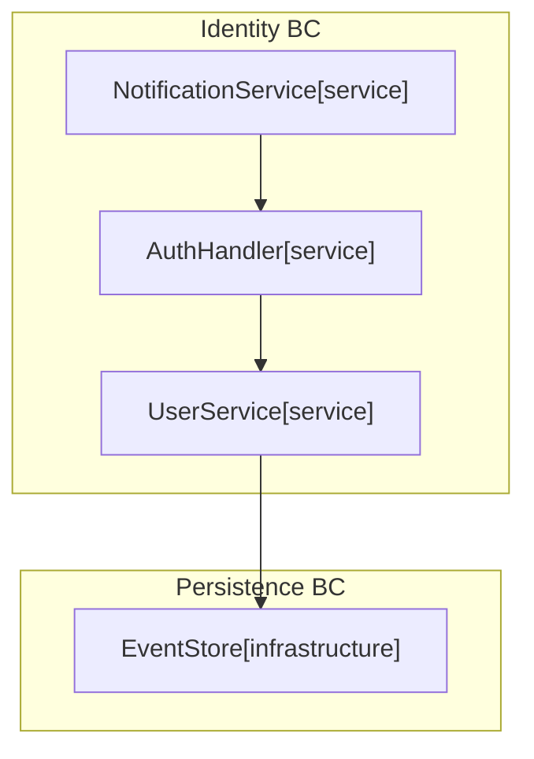

# Context Engineering for AI-Assisted Codebases: A Hands-On Tutorial

> A step-by-step guide to `@libar-dev/delivery-process` -- annotate your TypeScript, generate living docs, and give AI agents structured context instead of stale Markdown.

---

## Test Environment

This tutorial was executed end-to-end on a clean machine. Every CLI output shown below is captured verbatim from the test run.

| Property | Value |
|---|---|
| **Date** | 2026-02-21 |
| **Node.js** | v22.17.1 |
| **npm** | 11.6.1 |
| **Package** | `@libar-dev/delivery-process` v1.0.0-pre.0 |
| **OS** | macOS (Darwin 25.2.0) |
| **Preset** | `libar-generic` |

---

## Introduction

You have 50 TypeScript files. An AI coding agent asks: "What depends on UserService?" Today, you point it at a stale README or a Confluence page from last quarter. The agent guesses at imports and hallucinates relationships that do not exist.

**Context engineering** solves this by making code the single source of truth for delivery state. Instead of maintaining separate documents that drift within days, you place structured annotations directly in your source files. A CLI then extracts those annotations, generates living documentation, and answers queries with typed JSON -- all derived from code, all regenerated in seconds.

### What you will build

A small TypeScript project with three annotated implementation files, two Gherkin feature specs, and one design stub. By the end, the system will have:

- **Extracted** 11 patterns, their relationships, and 5 business rules from your source files
- **Generated** 26 documentation files including architecture diagrams, roadmaps, pattern registries, and business rule references
- **Answered** structured CLI queries about dependency chains, blocking analysis, bounded contexts, and pattern metadata

### What you will learn

| Part | Topic | What You Do | Time |
|------|-------|-------------|------|
| 1 | Project Setup | Initialize a project with all dependencies | 3 min |
| 2 | Configuration | Configure sources, output, and presets | 3 min |
| 3 | First Annotation | Annotate one file and see it detected | 5 min |
| 4 | Adding Richness | Layer in architecture, enrichment, and shape tags | 7 min |
| 5 | Relationships | Connect multiple files into a dependency graph | 7 min |
| 6 | Doc Generation | Generate pattern registry and roadmap | 5 min |
| 7 | Gherkin Specs | Write plan-level specs with business rules | 8 min |
| 8 | Design Stubs | Describe future implementations | 4 min |
| 9 | Full Generation | Generate all 26 docs + reference docs + linting | 7 min |
| 10 | Advanced Queries | Query project state with advanced CLI commands | 5 min |

**Total: ~55 minutes** | **Prerequisites:** Node.js >= 18, npm

---

## Part 1: Project Setup

### 1.1 Initialize the project

```bash
mkdir dp-mini-demo && cd dp-mini-demo
npm init -y
```

Edit `package.json` to set `"type": "module"` and `"private": true`:

```json
{
  "name": "dp-mini-demo",
  "version": "1.0.0",
  "type": "module",
  "private": true
}
```

### 1.2 Install dependencies

```bash
npm install @libar-dev/delivery-process@pre
```

```
added 63 packages, and audited 64 packages in 4s

23 packages are looking for funding
  run `npm fund` for details
```

```bash
npm install -D typescript tsx
```

```
added 31 packages, and audited 95 packages in 3s

25 packages are looking for funding
  run `npm fund` for details
```

> **Pre-release note:** The `@pre` dist-tag installs the latest pre-release version (currently v1.0.0-pre.0). Once 1.0.0 stable ships, this becomes `npm install @libar-dev/delivery-process`.

- `@libar-dev/delivery-process` -- the documentation generation engine
- `typescript` -- for type checking
- `tsx` -- for running TypeScript CLI tools directly

### 1.3 Create tsconfig.json

```json
{
  "compilerOptions": {
    "target": "ES2022",
    "module": "NodeNext",
    "moduleResolution": "NodeNext",
    "strict": true,
    "esModuleInterop": true,
    "skipLibCheck": true,
    "outDir": "dist"
  },
  "include": ["src/**/*.ts", "delivery-process.config.ts"]
}
```

### 1.4 Create folder structure

```bash
mkdir -p src/sample-sources src/specs src/stubs
```

### Checkpoint: Part 1

- `package.json` has `"type": "module"`
- `@libar-dev/delivery-process` appears in dependencies
- `typescript` and `tsx` appear in devDependencies
- `tsconfig.json` exists
- Empty folders: `src/sample-sources/`, `src/specs/`, `src/stubs/`

---

## Part 2: Configuration

With the project scaffolded, you now tell the delivery process where to find your sources and where to write generated docs.

### 2.1 Create `delivery-process.config.ts`

```typescript
import { defineConfig } from "@libar-dev/delivery-process/config";

export default defineConfig({
  preset: "libar-generic",
  sources: {
    typescript: ["src/sample-sources/**/*.ts"],
    features: ["src/specs/**/*.feature"],
    stubs: ["src/stubs/**/*.ts"],
  },
  output: {
    directory: "docs-generated",
    overwrite: true,
  },
});
```

### 2.2 Configuration fields explained

| Field | Purpose |
|---|---|
| `preset` | Tag taxonomy preset -- determines the tag prefix and available categories |
| `sources.typescript` | Glob patterns for your implementation TypeScript files |
| `sources.features` | Glob patterns for Gherkin `.feature` files (plan-level specs) |
| `sources.stubs` | Glob patterns for design-level stub TypeScript files |
| `output.directory` | Where generated docs are written. Default: `docs/architecture` |
| `output.overwrite` | Whether to overwrite existing files. Default: `false` |

### 2.3 Available presets

| Preset | Tag Prefix | File Opt-In | Categories |
|---|---|---|---|
| `generic` | `@docs-` | `@docs` | 3: core, api, infra |
| `libar-generic` | `@libar-docs-` | `@libar-docs` | 3: core, api, infra |
| `ddd-es-cqrs` | `@libar-docs-` | `@libar-docs` | 21: full DDD taxonomy |

This tutorial uses `libar-generic` throughout. It provides three categories (`core`, `api`, `infra`) with the `@libar-docs-` tag prefix.

### 2.4 Add npm scripts

Add the following to your `package.json` scripts:

```json
{
  "scripts": {
    "process:query":    "tsx ./node_modules/@libar-dev/delivery-process/dist/cli/process-api.js",
    "process:overview": "tsx ./node_modules/@libar-dev/delivery-process/dist/cli/process-api.js overview",
    "process:status":   "tsx ./node_modules/@libar-dev/delivery-process/dist/cli/process-api.js status",
    "process:list":     "tsx ./node_modules/@libar-dev/delivery-process/dist/cli/process-api.js list",
    "process:tags":     "tsx ./node_modules/@libar-dev/delivery-process/dist/cli/process-api.js tags",
    "process:sources":  "tsx ./node_modules/@libar-dev/delivery-process/dist/cli/process-api.js sources",
    "process:rules":    "tsx ./node_modules/@libar-dev/delivery-process/dist/cli/process-api.js rules",
    "process:stubs":    "tsx ./node_modules/@libar-dev/delivery-process/dist/cli/process-api.js stubs",

    "docs:patterns":       "tsx ./node_modules/@libar-dev/delivery-process/dist/cli/generate-docs.js -g patterns -f",
    "docs:roadmap":        "tsx ./node_modules/@libar-dev/delivery-process/dist/cli/generate-docs.js -g roadmap -f",
    "docs:reference":      "tsx ./node_modules/@libar-dev/delivery-process/dist/cli/generate-docs.js -g reference-docs -f",
    "docs:overview":       "tsx ./node_modules/@libar-dev/delivery-process/dist/cli/generate-docs.js -g overview-rdm -f",
    "docs:architecture":   "tsx ./node_modules/@libar-dev/delivery-process/dist/cli/generate-docs.js -g architecture -f",
    "docs:business-rules": "tsx ./node_modules/@libar-dev/delivery-process/dist/cli/generate-docs.js -g business-rules -f",
    "docs:taxonomy":       "tsx ./node_modules/@libar-dev/delivery-process/dist/cli/generate-docs.js -g taxonomy -f",
    "docs:all":            "tsx ./node_modules/@libar-dev/delivery-process/dist/cli/generate-docs.js -g patterns,roadmap,reference-docs,overview-rdm,architecture,business-rules,taxonomy -f",
    "docs:list":           "tsx ./node_modules/@libar-dev/delivery-process/dist/cli/generate-docs.js --list-generators",

    "lint:patterns": "tsx ./node_modules/@libar-dev/delivery-process/dist/cli/lint-patterns.js -i \"src/sample-sources/**/*.ts\"",
    "lint:validate": "tsx ./node_modules/@libar-dev/delivery-process/dist/cli/validate-patterns.js -i \"src/sample-sources/**/*.ts\" --features \"src/specs/**/*.feature\""
  }
}
```

There are two categories of scripts:

**`process:*`** -- Query the Process Data API. These scan your sources and return structured data (JSON or formatted text) about your patterns, status, relationships, and business rules. They never write files.

**`docs:*`** -- Run doc generators. These scan your sources and write markdown files to `docs-generated/`.

### 2.5 Your first Process Data API call

Even with no source files yet, you can run:

```bash
npm run process:overview
```

```
=== PROGRESS ===
0 patterns (0 completed, 0 active, 0 planned) = 0%
```

> **Note:** The actual output also includes a `=== DATA API ===` help reference section listing available subcommands. This section is omitted from the article outputs for brevity. See the [Issues & Improvements](#issues--improvements-for-next-revision) section for details.

The Process Data API is your window into the delivery process state. We will use it after every change to see what the system detects.

### Checkpoint: Part 2

- `delivery-process.config.ts` exists with `defineConfig()`
- `package.json` has all `process:*` and `docs:*` scripts
- `npm run process:overview` runs without errors

---

## Part 3: Your First Annotation

With configuration in place, you now annotate one TypeScript file and see the system detect it.

### 3.1 File opt-in

Every file that the scanner should process needs a **file opt-in marker**. For the `libar-generic` preset, this is:

```typescript
/** @libar-docs */
```

This must be a standalone JSDoc comment at the top of the file. Without it, the file is invisible to the scanner.

### 3.2 Create your first annotated source

Create `src/sample-sources/user-service.ts` with just the essential tags:

```typescript
/** @libar-docs */

/**
 * @libar-docs-pattern UserService
 * @libar-docs-status active
 * @libar-docs-core
 * @libar-docs-brief Core user lifecycle management service
 *
 * ## UserService - User Lifecycle Management
 *
 * Manages user lifecycle — registration, lookup, and deactivation.
 *
 * ### When to Use
 *
 * - When registering new users
 * - When looking up user information
 * - When deactivating user accounts
 */

export class UserService {
  private users = new Map<string, { id: string; email: string; active: boolean }>();

  register(email: string): string {
    const id = crypto.randomUUID();
    this.users.set(id, { id, email, active: true });
    return id;
  }

  findById(id: string): { id: string; email: string; active: boolean } | null {
    return this.users.get(id) ?? null;
  }

  deactivate(id: string): boolean {
    const user = this.users.get(id);
    if (!user) return false;
    user.active = false;
    return true;
  }
}
```

Four tags is all you need to get started:
- `@libar-docs-pattern UserService` -- names this pattern (required)
- `@libar-docs-status active` -- FSM status: `roadmap` -> `active` -> `completed`, or `deferred`
- `@libar-docs-core` -- category assignment (flag tag -- no value needed)
- `@libar-docs-brief` -- short description for summary tables

### 3.3 See it detected

```bash
npm run process:overview
```

```
=== PROGRESS ===
1 patterns (0 completed, 1 active, 0 planned) = 0%
```

> **What just happened:** The scanner found `user-service.ts`, detected the `@libar-docs` opt-in marker, and extracted the `UserService` pattern with status `active` in the `core` category. One file, one pattern -- and it is already queryable.

Verify which files the scanner found:

```bash
npm run process:sources
```

```json
{
  "success": true,
  "data": {
    "types": [
      {
        "type": "TypeScript (annotated)",
        "count": 1,
        "locationPattern": "src/sample-sources/**/*.ts",
        "files": [
          "src/sample-sources/user-service.ts"
        ]
      }
    ],
    "totalFiles": 1
  },
  "metadata": {
    "timestamp": "2026-02-21T07:59:56.192Z",
    "patternCount": 1
  }
}
```

### Recap: Part 3

You created one annotated file and proved the scanner detects it. The minimum viable annotation is:

1. `@libar-docs` -- file opt-in marker
2. `@libar-docs-pattern Name` -- names the pattern
3. `@libar-docs-status` -- FSM status
4. A category flag (`@libar-docs-core`, `-api`, or `-infra`)

Next, you will add tags that make the documentation richer.

---

## Part 4: Adding Richness Layer by Layer

In Part 3 you created a working annotation with 4 tags. Now you will layer in architecture, enrichment, and shape extraction tags -- each group unlocks new documentation capabilities.

### 4.1 Add architecture tags

Add these three tags to the JSDoc block in `user-service.ts`, after `@libar-docs-brief`:

```typescript
 * @libar-docs-arch-role service
 * @libar-docs-arch-context identity
 * @libar-docs-arch-layer application
```

Architecture tags place your pattern in a structured topology:

| Tag | Example | Purpose |
|---|---|---|
| `@libar-docs-arch-role` | `service` | Component type: `service`, `infrastructure`, etc. |
| `@libar-docs-arch-context` | `identity` | Bounded context (creates diagram subgraphs) |
| `@libar-docs-arch-layer` | `application` | Architecture layer: `domain`, `application`, `infrastructure` |

Run `npm run process:tags` to see architecture metadata in the tag usage report:

```bash
npm run process:tags
```

```json
{
  "success": true,
  "data": {
    "tags": [
      { "tag": "status", "count": 1, "values": [{ "value": "active", "count": 1 }] },
      { "tag": "category", "count": 1, "values": [{ "value": "core", "count": 1 }] },
      { "tag": "arch-role", "count": 1, "values": [{ "value": "service", "count": 1 }] },
      { "tag": "arch-context", "count": 1, "values": [{ "value": "identity", "count": 1 }] },
      { "tag": "arch-layer", "count": 1, "values": [{ "value": "application", "count": 1 }] }
    ],
    "patternCount": 1
  }
}
```

> **What just happened:** Architecture tags tell the system where this component lives in your system topology. These drive the Mermaid diagrams generated later -- bounded contexts become subgraphs, roles become node labels.

### 4.2 Add enrichment tags

Add these tags to `user-service.ts`:

```typescript
 * @libar-docs-usecase "Register a new user account via the signup form"
 * @libar-docs-usecase "Look up a user by ID for profile display"
 * @libar-docs-usecase "Deactivate a compromised user account"
 * @libar-docs-quarter Q1-2026
 * @libar-docs-phase 1
 * @libar-docs-release v0.1.0
```

| Tag | Example | Purpose |
|---|---|---|
| `@libar-docs-usecase` | `"Register a new user..."` | Use cases (quoted, repeatable) |
| `@libar-docs-quarter` | `Q1-2026` | Timeline tracking |
| `@libar-docs-phase` | `1` | Roadmap phase number |
| `@libar-docs-release` | `v0.1.0` | Target release version |

```bash
npm run process:overview
```

```
=== PROGRESS ===
1 patterns (0 completed, 1 active, 0 planned) = 0%

=== ACTIVE PHASES ===
Phase 1: Inception (1 active)
```

> **What just happened:** The `@libar-docs-phase 1` tag assigns UserService to Phase 1. Phase names like "Inception" come from the **6-phase-standard** workflow built into the preset. The six phases are: Inception, Elaboration, Session, Construction, Validation, Retrospective.

### 4.3 Add shape extraction

Shape extraction pulls TypeScript interfaces into your generated docs. Add this tag to the pattern's JSDoc block:

```typescript
 * @libar-docs-extract-shapes UserRecord
```

Then add the interface above the class, with its own shape tag:

```typescript
/** @libar-docs-shape reference-sample */
export interface UserRecord {
  id: string;
  email: string;
  active: boolean;
}
```

| Tag | Example | Purpose |
|---|---|---|
| `@libar-docs-extract-shapes` | `UserRecord` | Extract named TypeScript types into docs |
| `@libar-docs-shape` | `reference-sample` | Mark an interface for shape discovery (optional group name) |

```bash
npm run process:overview
```

```
=== PROGRESS ===
2 patterns (0 completed, 1 active, 1 planned) = 0%

=== ACTIVE PHASES ===
Phase 1: Inception (1 active)
```

The pattern count increased from 1 to 2 -- `UserRecord` now appears as a separate shape pattern in the registry.

> **Note:** `@libar-docs-shape` on an interface creates a lightweight "Shape" entry. The linter will flag these for missing `@libar-docs-pattern` names, which is expected and harmless.

### 4.4 Full tag reference

Here is the complete tag reference for TypeScript annotations. You have now used every group:

**Identity & Status:**

| Tag | Example | Purpose |
|---|---|---|
| `@libar-docs-pattern` | `UserService` | Names this pattern (required) |
| `@libar-docs-status` | `active` | FSM status: `roadmap` -> `active` -> `completed`, or `deferred` |
| `@libar-docs-core` | _(flag)_ | Category assignment. Also: `@libar-docs-api`, `@libar-docs-infra` |

**Architecture:**

| Tag | Example | Purpose |
|---|---|---|
| `@libar-docs-arch-role` | `service` | Component type |
| `@libar-docs-arch-context` | `identity` | Bounded context |
| `@libar-docs-arch-layer` | `application` | Architecture layer |

**Enrichment:**

| Tag | Example | Purpose |
|---|---|---|
| `@libar-docs-brief` | `Core user lifecycle...` | Short description for summary tables |
| `@libar-docs-usecase` | `"Register a new user..."` | Use cases (quoted, repeatable) |
| `@libar-docs-quarter` | `Q1-2026` | Timeline tracking |
| `@libar-docs-phase` | `1` | Roadmap phase number |
| `@libar-docs-release` | `v0.1.0` | Target release version |

**Shapes:**

| Tag | Example | Purpose |
|---|---|---|
| `@libar-docs-extract-shapes` | `UserRecord` | Extract named types into docs |
| `@libar-docs-shape` | `reference-sample` | Mark an interface for shape discovery |

### Checkpoint: Part 4

- `user-service.ts` has architecture tags (`arch-role`, `arch-context`, `arch-layer`)
- `user-service.ts` has enrichment tags (`usecase`, `quarter`, `phase`, `release`)
- `user-service.ts` has shape extraction (`extract-shapes` + `@libar-docs-shape` on interface)
- `npm run process:overview` shows "Phase 1: Inception"

### Recap: Part 4

Starting from 4 tags, you added three groups:

- **Architecture tags** -- role, context, layer -> drive Mermaid diagrams
- **Enrichment tags** -- use cases, timeline, release -> drive roadmaps and detail pages
- **Shape extraction** -- TypeScript interfaces become API type documentation

Your single file now carries enough metadata to generate rich, multi-format documentation.

---

## Part 5: Relationships & Multiple Sources

In Part 4, you enriched a single file with architecture and enrichment tags. Now you will connect multiple files into a live dependency graph.

### 5.1 Add relationship tags to user-service.ts

Add these tags to `user-service.ts`:

```typescript
 * @libar-docs-used-by AuthHandler
 * @libar-docs-uses EventStore
 * @libar-docs-depends-on EventStore
 * @libar-docs-see-also AuthHandler, EventStore
```

These reference patterns that do not exist yet -- that is intentional. The system will track these as pending references until you create the matching files.

**Relationship tags:**

| Tag | Example | Purpose |
|---|---|---|
| `@libar-docs-uses` | `EventStore` | Direct dependency (solid arrow `-->` in diagrams) |
| `@libar-docs-used-by` | `AuthHandler` | Reverse dependency |
| `@libar-docs-depends-on` | `EventStore` | Roadmap sequencing (dashed arrow `-.->`) |
| `@libar-docs-enables` | `UserService` | Reverse sequencing |
| `@libar-docs-see-also` | `AuthHandler, EventStore` | Cross-reference without dependency |

### 5.2 The full user-service.ts

After all the additions from Parts 3-5, your file should look like this:

```typescript
/** @libar-docs */

/**
 * @libar-docs-pattern UserService
 * @libar-docs-status active
 * @libar-docs-core
 * @libar-docs-arch-role service
 * @libar-docs-arch-context identity
 * @libar-docs-arch-layer application
 * @libar-docs-used-by AuthHandler
 * @libar-docs-uses EventStore
 * @libar-docs-extract-shapes UserRecord
 * @libar-docs-phase 1
 * @libar-docs-release v0.1.0
 * @libar-docs-brief Core user lifecycle management service
 * @libar-docs-usecase "Register a new user account via the signup form"
 * @libar-docs-usecase "Look up a user by ID for profile display"
 * @libar-docs-usecase "Deactivate a compromised user account"
 * @libar-docs-quarter Q1-2026
 * @libar-docs-depends-on EventStore
 * @libar-docs-see-also AuthHandler, EventStore
 *
 * ## UserService - User Lifecycle Management
 *
 * Manages user lifecycle — registration, lookup, and deactivation.
 *
 * ### When to Use
 *
 * - When registering new users
 * - When looking up user information
 * - When deactivating user accounts
 */

/** @libar-docs-shape reference-sample */
export interface UserRecord {
  id: string;
  email: string;
  active: boolean;
}

export class UserService {
  private users = new Map<string, UserRecord>();

  register(email: string): string {
    const id = crypto.randomUUID();
    this.users.set(id, { id, email, active: true });
    return id;
  }

  findById(id: string): UserRecord | null {
    return this.users.get(id) ?? null;
  }

  deactivate(id: string): boolean {
    const user = this.users.get(id);
    if (!user) return false;
    user.active = false;
    return true;
  }
}
```

### 5.3 Add two more patterns

Create `src/sample-sources/auth-handler.ts`:

```typescript
/** @libar-docs */

/**
 * @libar-docs-pattern AuthHandler
 * @libar-docs-status roadmap
 * @libar-docs-api
 * @libar-docs-arch-role service
 * @libar-docs-arch-context identity
 * @libar-docs-arch-layer application
 * @libar-docs-uses UserService
 * @libar-docs-extract-shapes AuthResult
 * @libar-docs-phase 2
 * @libar-docs-release vNEXT
 * @libar-docs-brief Authentication and session management handler
 * @libar-docs-usecase "Authenticate a user with email and password"
 * @libar-docs-usecase "Validate an active session token"
 * @libar-docs-depends-on UserService
 * @libar-docs-quarter Q1-2026
 * @libar-docs-see-also UserService
 *
 * ## AuthHandler - Authentication & Sessions
 *
 * Handles authentication and session management.
 *
 * ### When to Use
 *
 * - When authenticating user credentials
 * - When creating or validating sessions
 */

/** @libar-docs-shape reference-sample */
export interface AuthResult {
  success: boolean;
  sessionId?: string;
  error?: string;
}

export class AuthHandler {
  authenticate(email: string, password: string): AuthResult {
    if (email.length === 0 || password.length < 8) {
      return { success: false, error: "Invalid credentials" };
    }
    return { success: true, sessionId: `session-${Date.now()}` };
  }

  createSession(userId: string): string {
    return `session-${userId}-${Date.now()}`;
  }
}
```

Create `src/sample-sources/event-store.ts`:

```typescript
/** @libar-docs */

/**
 * @libar-docs-pattern EventStore
 * @libar-docs-status deferred
 * @libar-docs-infra
 * @libar-docs-arch-role infrastructure
 * @libar-docs-arch-context persistence
 * @libar-docs-arch-layer infrastructure
 * @libar-docs-used-by UserService
 * @libar-docs-extract-shapes DomainEvent
 * @libar-docs-phase 3
 * @libar-docs-release vNEXT
 * @libar-docs-brief Append-only event store for domain event persistence
 * @libar-docs-usecase "Persist a domain event after a user action"
 * @libar-docs-usecase "Replay events for audit trail or debugging"
 * @libar-docs-quarter Q2-2026
 * @libar-docs-enables UserService
 * @libar-docs-see-also UserService
 *
 * ## EventStore - Append-Only Event Storage
 *
 * Append-only event store for domain events.
 * Deferred pending infrastructure decisions.
 *
 * ### When to Use
 *
 * - When persisting domain events
 * - When replaying event history
 */

/** @libar-docs-shape reference-sample */
export interface DomainEvent {
  type: string;
  payload: unknown;
  timestamp: number;
}

export class EventStore {
  private events: DomainEvent[] = [];

  append(type: string, payload: unknown): void {
    this.events.push({ type, payload, timestamp: Date.now() });
  }

  getAll(): DomainEvent[] {
    return [...this.events];
  }

  getByType(type: string): DomainEvent[] {
    return this.events.filter((e) => e.type === type);
  }
}
```

These files use the same tag patterns you learned: identity + architecture + enrichment + shapes + relationships. `AuthHandler` uses `UserService`, while `EventStore` is used by `UserService` and has status `deferred`.

### 5.4 See the dependency graph

```bash
npm run process:overview
```

```
=== PROGRESS ===
6 patterns (0 completed, 1 active, 5 planned) = 0%

=== ACTIVE PHASES ===
Phase 1: Inception (1 active)

=== BLOCKING ===
UserService blocked by: EventStore
AuthHandler blocked by: UserService
```

> **What just happened:** The system automatically computed the dependency chain: AuthHandler depends on UserService, which depends on EventStore. The blocking report surfaces this -- no manual tracking needed.

Explore the full dependency tree:

```bash
npm run process:query -- dep-tree AuthHandler
```

```
EventStore (3, deferred)
  -> UserService (1, active)
    -> AuthHandler (2, roadmap) <- YOU ARE HERE
```

This shows the chain from root dependency (EventStore) through UserService to AuthHandler, with phase numbers and statuses at each level.

### 5.5 Bounded contexts

List all bounded contexts:

```bash
npm run process:query -- arch context
```

```json
{
  "success": true,
  "data": [
    {
      "context": "identity",
      "count": 2,
      "patterns": ["UserService", "AuthHandler"]
    },
    {
      "context": "persistence",
      "count": 1,
      "patterns": ["EventStore"]
    }
  ]
}
```

> **Note:** The identity context has count 2 (UserService and AuthHandler) -- not 3 as you might expect. The shape patterns (UserRecord, AuthResult, DomainEvent) do not have `arch-context` tags, so they are not counted in bounded context groupings. Only patterns with explicit `@libar-docs-arch-context` tags appear here.

### 5.6 Filter by status

```bash
npm run process:query -- list --status roadmap
```

```json
{
  "success": true,
  "data": [
    {
      "patternName": "AuthHandler",
      "category": "api",
      "file": "src/sample-sources/auth-handler.ts",
      "source": "typescript",
      "status": "roadmap",
      "phase": 2
    }
  ]
}
```

Only AuthHandler has status `roadmap` at this point. EventStore is `deferred`, not `roadmap` -- the `list --status roadmap` filter correctly excludes it.

### Checkpoint: Part 5

Before moving on, verify:
- `npm run process:sources` shows 3 TypeScript files
- `npm run process:overview` shows 6 patterns (3 main + 3 shapes)
- `npm run process:query -- arch context` shows `identity` and `persistence`
- `npm run process:query -- dep-tree AuthHandler` shows a dependency chain

### Recap: Part 5

- Multiple sources with `@libar-docs-uses` and `@libar-docs-depends-on` create a live dependency graph
- The `process:overview` blocking report surfaces dependency chains automatically
- `dep-tree` shows recursive dependencies for any pattern
- Pattern names in relationship tags must match exactly (case-sensitive)

---

## Part 6: Generate Documentation

You have 3 annotated TypeScript files with rich metadata and relationships. Now you will generate living documentation from these annotations.

### 6.1 Generate the Pattern Registry

```bash
npm run docs:patterns
```

```
Using sources from delivery-process.config.ts...
Scanning source files...
  Found 6 patterns
Extracting patterns...
  Extracted 6 patterns

Running generator: patterns
  ✓ PATTERNS.md
  ✓ patterns/user-service.md
  ✓ patterns/user-record.md
  ✓ patterns/event-store.md
  ✓ patterns/domain-event.md
  ✓ patterns/auth-handler.md
  ✓ patterns/auth-result.md

✅ Documentation generation complete!
   7 files written
```

**`PATTERNS.md`** is the pattern registry -- an index of all patterns with:
- Progress bar and status counts (completed / active / planned)
- Categorized listing (API, Core, Infra, Shape)
- Brief descriptions from `@libar-docs-brief`
- A Mermaid dependency graph showing `uses` (solid), `depends-on` (dashed), and `implements` (dotted) relationships

**`patterns/*.md`** are per-pattern detail pages with:
- Status, category, phase, quarter metadata table
- Description from JSDoc markdown
- Use cases from `@libar-docs-usecase` tags
- Dependencies list

### 6.2 Generate the Roadmap

```bash
npm run docs:roadmap
```

```
Using sources from delivery-process.config.ts...
Scanning source files...
  Found 6 patterns
Extracting patterns...
  Extracted 6 patterns

Running generator: roadmap
  ✓ ROADMAP.md
  ✓ phases/phase-01-inception.md
  ✓ phases/phase-02-elaboration.md
  ✓ phases/phase-03-session.md

✅ Documentation generation complete!
   4 files written
```

**`ROADMAP.md`** organizes patterns by phase with:
- Overall progress bar and metrics
- Phase navigation table with per-phase completion percentages
- Per-phase sections listing patterns with descriptions

Phase names come from the default **6-phase-standard** workflow: Inception, Elaboration, Session, Construction, Validation, Retrospective. Patterns are assigned to phases via `@libar-docs-phase N`.

### Checkpoint: Part 6

- `docs-generated/PATTERNS.md` exists with a Mermaid dependency graph
- `docs-generated/patterns/` has individual pattern detail pages
- `docs-generated/ROADMAP.md` exists with phase sections
- `docs-generated/phases/` has phase detail pages

### Recap: Part 6

- `patterns` generator -> registry index + per-pattern detail pages
- `roadmap` generator -> phase-based roadmap + per-phase detail pages
- All content is derived from your annotations -- change the code, regenerate, docs update

---

## Part 7: Plan-Level Specs (Gherkin Features)

TypeScript annotations describe what exists. Gherkin features describe what needs to be built -- acceptance criteria, deliverables, and business rules that complement your code annotations.

### 7.1 Reading Gherkin

> **Quick primer:** In Gherkin files, tags before `Feature:` are metadata (like JSDoc tags). `Background:` sets up shared context. `Rule:` blocks define business constraints. `Scenario:` blocks are individual test cases with Given/When/Then steps.

### 7.2 Create `src/specs/user-registration.feature`

> **Important:** Gherkin features must include the `@libar-docs` opt-in tag. Without it, the scanner ignores the file entirely -- just like TypeScript files.

```gherkin
@libar-docs
@libar-docs-pattern:UserRegistration
@libar-docs-status:roadmap
@libar-docs-core
@libar-docs-phase:1
@libar-docs-release:v0.1.0
@libar-docs-uses:UserService
@libar-docs-implements:UserService
@libar-docs-quarter:Q1-2026
Feature: User Registration
  As a new user
  I want to register an account
  So that I can access the system

  Background: Deliverables
    Given the following deliverables:
      | Deliverable             | Status  | Location                           |
      | Registration endpoint   | Pending | src/sample-sources/user-service.ts |
      | Email validation        | Pending | src/sample-sources/user-service.ts |
      | Duplicate check         | Pending | src/sample-sources/user-service.ts |

  Rule: Valid registrations create new accounts

    **Invariant:** Each email address maps to exactly one user account.
    **Rationale:** Prevents account confusion and ensures unique identity.

    @happy-path
    Scenario: Successful registration with valid email
      Given a valid email "alice@example.com"
      When the user submits the registration form
      Then a new account should be created
      And a confirmation email should be sent

    @happy-path
    Scenario: Registration assigns a unique user ID
      Given a valid email "bob@example.com"
      When the user submits the registration form
      Then the returned user ID should be a valid UUID
      And the user should be marked as active

  Rule: Invalid input is rejected before account creation

    **Invariant:** No user record is created for invalid input.
    **Rationale:** Prevents polluting the user store with bad data.

    @validation @business-rule
    Scenario: Registration fails with empty email
      Given an empty email ""
      When the user submits the registration form
      Then the registration should be rejected
      And an error message should indicate the email is invalid

  Rule: Duplicate emails are rejected

    **Invariant:** Registration with an existing email always fails.
    **Rationale:** Enforces unique identity constraint at the application boundary.

    @business-rule
    Scenario: Registration fails with duplicate email
      Given an existing user with email "alice@example.com"
      When another user tries to register with "alice@example.com"
      Then the registration should be rejected
      And an error message should indicate the email is taken
```

### 7.3 Gherkin annotation anatomy

**Feature-level tags** (before `Feature:`) use colon syntax -- not spaces like TypeScript:

| Syntax | Context | Example |
|---|---|---|
| Space-separated | TypeScript JSDoc | `@libar-docs-pattern UserService` |
| Colon-separated | Gherkin tags | `@libar-docs-pattern:UserRegistration` |

Key feature-level tags:

| Tag | Purpose |
|---|---|
| `@libar-docs` | **Required.** Opts the file into scanning. |
| `@libar-docs-pattern:UserRegistration` | Names this as a pattern. |
| `@libar-docs-implements:UserService` | Links this spec to the TypeScript pattern it specifies (dotted arrows in diagrams). |
| `@libar-docs-depends-on:UserRegistration` | Roadmap sequencing between specs. |

**Background: Deliverables** -- A data table under `Background:` that tracks deliverables. Each row specifies a deliverable name, its status, and the source file where it will be implemented. These show up in roadmap tracking and pattern detail pages.

**Rule: blocks** -- Gherkin `Rule:` blocks are extracted as business rules. Add structured annotations inside the rule description:

- `**Invariant:**` -- The constraint that must hold (extracted verbatim)
- `**Rationale:**` -- Why the invariant matters
- Scenarios under the rule are linked as `Verified by:` entries

**Semantic scenario tags** -- Tags like `@happy-path`, `@validation`, `@business-rule` categorize scenarios for reporting.

### 7.4 Add a second feature spec

Create `src/specs/authentication.feature`:

```gherkin
@libar-docs
@libar-docs-pattern:Authentication
@libar-docs-status:roadmap
@libar-docs-api
@libar-docs-phase:2
@libar-docs-release:vNEXT
@libar-docs-uses:UserService
@libar-docs-implements:AuthHandler
@libar-docs-depends-on:UserRegistration
@libar-docs-quarter:Q1-2026
Feature: Authentication
  As a registered user
  I want to log in to my account
  So that I can access protected resources

  Background: Deliverables
    Given the following deliverables:
      | Deliverable            | Status  | Location                           |
      | Login endpoint         | Pending | src/sample-sources/auth-handler.ts |
      | Session token creation | Pending | src/sample-sources/auth-handler.ts |

  Rule: Valid credentials grant access

    **Invariant:** A session token is only issued for valid credential pairs.
    **Rationale:** Prevents unauthorized access to the system.

    @happy-path
    Scenario: Successful login with valid credentials
      Given a registered user with email "alice@example.com"
      When the user submits valid login credentials
      Then a session token should be returned
      And the session should be marked as active

  Rule: Invalid credentials are rejected securely

    **Invariant:** Error messages never reveal whether the email or password was wrong.
    **Rationale:** Prevents credential enumeration attacks.

    @business-rule @validation
    Scenario: Login fails with wrong password
      Given a registered user with email "alice@example.com"
      When the user logs in with an incorrect password
      Then authentication should fail
      And the error should say "Invalid credentials"
```

This feature demonstrates cross-pattern traceability:
- `@libar-docs-implements:AuthHandler` -- links this spec to the TypeScript implementation
- `@libar-docs-depends-on:UserRegistration` -- sequencing between specs

### 7.5 Query business rules

```bash
npm run process:rules
```

```json
{
  "success": true,
  "data": {
    "productAreas": [
      {
        "productArea": "Platform",
        "ruleCount": 5,
        "invariantCount": 5,
        "phases": [
          {
            "phase": "Phase 1",
            "features": [
              {
                "pattern": "UserRegistration",
                "source": "src/specs/user-registration.feature",
                "rules": [
                  {
                    "name": "Valid registrations create new accounts",
                    "invariant": "Each email address maps to exactly one user account.",
                    "rationale": "Prevents account confusion and ensures unique identity.",
                    "verifiedBy": [
                      "Successful registration with valid email",
                      "Registration assigns a unique user ID"
                    ],
                    "scenarioCount": 2
                  },
                  {
                    "name": "Invalid input is rejected before account creation",
                    "invariant": "No user record is created for invalid input.",
                    "rationale": "Prevents polluting the user store with bad data.",
                    "verifiedBy": ["Registration fails with empty email"],
                    "scenarioCount": 1
                  },
                  {
                    "name": "Duplicate emails are rejected",
                    "invariant": "Registration with an existing email always fails.",
                    "rationale": "Enforces unique identity constraint at the application boundary.",
                    "verifiedBy": ["Registration fails with duplicate email"],
                    "scenarioCount": 1
                  }
                ]
              }
            ]
          },
          {
            "phase": "Phase 2",
            "features": [
              {
                "pattern": "Authentication",
                "source": "src/specs/authentication.feature",
                "rules": [
                  {
                    "name": "Valid credentials grant access",
                    "invariant": "A session token is only issued for valid credential pairs.",
                    "rationale": "Prevents unauthorized access to the system.",
                    "verifiedBy": ["Successful login with valid credentials"],
                    "scenarioCount": 1
                  },
                  {
                    "name": "Invalid credentials are rejected securely",
                    "invariant": "Error messages never reveal whether the email or password was wrong.",
                    "rationale": "Prevents credential enumeration attacks.",
                    "verifiedBy": ["Login fails with wrong password"],
                    "scenarioCount": 1
                  }
                ]
              }
            ]
          }
        ]
      }
    ],
    "totalRules": 5,
    "totalInvariants": 5
  }
}
```

> **What just happened:** The system extracted 5 business rules from 2 Gherkin features, each with invariant statements and scenario verification links. Every `Rule:` block with an `**Invariant:**` becomes a queryable business rule.

### 7.6 Generate business rules documentation

```bash
npm run docs:business-rules
```

```
Using sources from delivery-process.config.ts...
Scanning source files...
  Found 8 patterns
Extracting patterns...
  Extracted 8 patterns

Running generator: business-rules
  ✓ BUSINESS-RULES.md
  ✓ business-rules/platform.md

✅ Documentation generation complete!
   2 files written
```

`BUSINESS-RULES.md` shows a summary: "5 rules from 2 features across 1 product area." The detail page `business-rules/platform.md` lists every invariant with its rationale and verification scenarios.

### 7.7 Check the enriched overview

```bash
npm run process:overview
```

```
=== PROGRESS ===
8 patterns (0 completed, 1 active, 7 planned) = 0%

=== ACTIVE PHASES ===
Phase 1: Inception (1 active)

=== BLOCKING ===
UserService blocked by: EventStore
AuthHandler blocked by: UserService
Authentication blocked by: UserRegistration
```

The Gherkin features added 2 more main patterns (UserRegistration, Authentication). The total is now 8 patterns (not 11 -- that count is reached after Part 8 adds the stub file). The blocking analysis now includes spec-level dependencies: Authentication is blocked by UserRegistration.

### 7.8 Verify all sources

```bash
npm run process:sources
```

```json
{
  "success": true,
  "data": {
    "types": [
      {
        "type": "TypeScript (annotated)",
        "count": 3,
        "locationPattern": "src/sample-sources/**/*.ts",
        "files": [
          "src/sample-sources/user-service.ts",
          "src/sample-sources/event-store.ts",
          "src/sample-sources/auth-handler.ts"
        ]
      },
      {
        "type": "Gherkin (features)",
        "count": 2,
        "locationPattern": "src/specs/**/*.feature",
        "files": [
          "src/specs/user-registration.feature",
          "src/specs/authentication.feature"
        ]
      }
    ],
    "totalFiles": 5
  }
}
```

### Checkpoint: Part 7

- `npm run process:sources` shows 3 TypeScript + 2 Gherkin files
- `npm run process:rules` returns 5 business rules
- `docs-generated/BUSINESS-RULES.md` exists
- `npm run process:overview` shows 8 patterns

### Recap: Part 7

- Gherkin features own planning metadata: status, phase, deliverables, business rules
- TypeScript owns implementation metadata: uses, used-by, shapes, architecture
- Together they form a complete picture -- neither duplicates the other
- `Rule:` blocks with `**Invariant:**`/`**Rationale:**` become queryable business rules
- Gherkin tags use colon syntax (`@libar-docs-pattern:Name`), TypeScript uses spaces

---

## Part 8: Design Stubs

Design stubs describe a pattern's design before the implementation exists. They document the API contract, design decisions, and target path -- making the "not yet built" parts of your system visible.

### 8.1 Create `src/stubs/notification-service.stub.ts`

```typescript
/** @libar-docs */

/**
 * @libar-docs-pattern NotificationService
 * @libar-docs-status roadmap
 * @libar-docs-infra
 * @libar-docs-arch-role service
 * @libar-docs-arch-context identity
 * @libar-docs-arch-layer infrastructure
 * @libar-docs-target src/sample-sources/notification-service.ts
 * @libar-docs-since design-session-1
 * @libar-docs-uses AuthHandler
 * @libar-docs-phase 2
 * @libar-docs-release vNEXT
 * @libar-docs-brief Notification service for auth lifecycle events
 * @libar-docs-usecase "Send welcome email after user registration"
 * @libar-docs-usecase "Send login alert for new device"
 * @libar-docs-quarter Q2-2026
 * @libar-docs-extract-shapes NotificationConfig, NotificationResult
 *
 * ## NotificationService - Auth Event Notifications
 *
 * Sends notifications (email, SMS) when authentication lifecycle
 * events occur. Stub — target implementation does not exist yet.
 *
 * ### Design Decisions
 *
 * AD-1: Use event-driven notifications (not inline calls)
 * AD-2: Support multiple channels via strategy pattern
 *
 * ### When to Use
 *
 * - When sending post-registration welcome emails
 * - When alerting users about new device logins
 */

/** @libar-docs-shape reference-sample */
export interface NotificationConfig {
  channel: "email" | "sms";
  template: string;
  recipientId: string;
}

/** @libar-docs-shape reference-sample */
export interface NotificationResult {
  sent: boolean;
  channel: string;
  timestamp: Date;
}
```

### 8.2 Stub-specific tags

| Tag | Example | Purpose |
|---|---|---|
| `@libar-docs-target` | `src/sample-sources/notification-service.ts` | Path where the real implementation will live. The resolver checks if this file exists. |
| `@libar-docs-since` | `design-session-1` | Identifies which design session created the stub. |

### 8.3 Query stubs

```bash
npm run process:stubs
```

```json
{
  "success": true,
  "data": [
    {
      "pattern": "NotificationConfig",
      "stubs": [
        {
          "stubName": "NotificationConfig",
          "stubFile": "src/stubs/notification-service.stub.ts",
          "targetPath": "",
          "targetExists": false
        }
      ],
      "resolvedCount": 0,
      "unresolvedCount": 1
    },
    {
      "pattern": "NotificationResult",
      "stubs": [
        {
          "stubName": "NotificationResult",
          "stubFile": "src/stubs/notification-service.stub.ts",
          "targetPath": "",
          "targetExists": false
        }
      ],
      "resolvedCount": 0,
      "unresolvedCount": 1
    },
    {
      "pattern": "NotificationService",
      "stubs": [
        {
          "stubName": "NotificationService",
          "stubFile": "src/stubs/notification-service.stub.ts",
          "targetPath": "src/sample-sources/notification-service.ts",
          "since": "design-session-1",
          "targetExists": false
        }
      ],
      "resolvedCount": 0,
      "unresolvedCount": 1
    }
  ]
}
```

> **What just happened:** The stubs query returns 3 entries, not just 1. The shape patterns (NotificationConfig and NotificationResult) from the stub file are also tracked as separate stub entries. Only NotificationService has a `targetPath` and `since` field -- the shapes have empty target paths because they lack their own `@libar-docs-target` tags. When you create the real file at `src/sample-sources/notification-service.ts`, the resolver will mark NotificationService as resolved.

### Checkpoint: Part 8

- `src/stubs/notification-service.stub.ts` exists with `@libar-docs-target` and `@libar-docs-since`
- `npm run process:stubs` shows 3 stub entries with `targetExists: false`
- `npm run process:sources` shows 1 stub file

### Recap: Part 8

- Stubs document API contracts before implementation exists
- `@libar-docs-target` tracks where the real file will live
- `@libar-docs-since` records which design session created the stub
- The stubs query shows resolution status -- unresolved stubs are visible work items
- Shape patterns defined in stub files also appear as separate stub entries

---

## Part 9: Reference Docs & Full Generation

You have all source types in place: TypeScript, Gherkin, and stubs. Now you will create a bespoke reference document, generate everything, and lint your annotations.

### 9.1 Add referenceDocConfigs to configuration

Update `delivery-process.config.ts` to add the `referenceDocConfigs` array:

```typescript
import { defineConfig } from "@libar-dev/delivery-process/config";

export default defineConfig({
  preset: "libar-generic",
  sources: {
    typescript: ["src/sample-sources/**/*.ts"],
    features: ["src/specs/**/*.feature"],
    stubs: ["src/stubs/**/*.ts"],
  },
  output: {
    directory: "docs-generated",
    overwrite: true,
  },
  referenceDocConfigs: [
    {
      title: "Identity & Persistence Reference",
      conventionTags: [],
      shapeSources: ["src/sample-sources/**/*.ts"],
      behaviorCategories: ["core", "api", "infra"],
      diagramScopes: [
        {
          archContext: ["identity", "persistence"],
          direction: "LR",
          title: "System Architecture",
          diagramType: "graph",
          showEdgeLabels: true,
        },
      ],
      claudeMdSection: "reference",
      docsFilename: "IDENTITY-PERSISTENCE-REFERENCE.md",
      claudeMdFilename: "identity-persistence-reference.md",
    },
  ],
});
```

### 9.2 Reference doc config fields

| Field | Purpose |
|---|---|
| `title` | Document heading |
| `conventionTags` | Convention tags to include (from `@libar-docs-convention`-tagged files) |
| `shapeSources` | Glob patterns for TypeScript shape extraction |
| `behaviorCategories` | Category filters -- which patterns' descriptions to include |
| `diagramScopes` | Scoped Mermaid diagrams with bounded context filtering |
| `claudeMdSection` | Target directory under `_claude-md/` for AI-consumption summary |
| `docsFilename` | Output filename in `docs/` for the detailed version |
| `claudeMdFilename` | Output filename in `_claude-md/` for the compact version |

**Diagram scope options:**

| Field | Purpose |
|---|---|
| `archContext` | Filter to patterns in these bounded contexts |
| `direction` | Mermaid graph direction: `TB` (top-bottom) or `LR` (left-right) |
| `diagramType` | `graph`, `sequenceDiagram`, `stateDiagram-v2`, `C4Context`, `classDiagram` |
| `showEdgeLabels` | Show relationship type labels on arrows |

### 9.3 Generate the reference doc

```bash
npm run docs:reference
```

```
Using sources from delivery-process.config.ts...
Scanning source files...
  Found 11 patterns
Extracting patterns...
  Extracted 11 patterns

Running generator: reference-docs
  ✓ docs/IDENTITY-PERSISTENCE-REFERENCE.md
  ✓ _claude-md/reference/identity-persistence-reference.md

✅ Documentation generation complete!
   2 files written
```

The generated reference doc includes:

**1. Architecture Diagram** -- A Mermaid graph scoped to `identity` and `persistence` contexts with labeled edges showing uses (solid) and depends-on (dashed) relationships.

**2. API Types** -- TypeScript interfaces extracted from shapes: `UserRecord`, `DomainEvent`, `AuthResult`.

**3. Behavior Specifications** -- Descriptions from each pattern's JSDoc, including Gherkin feature rule blocks with invariants.

Each `referenceDocConfigs` entry produces two files: a detailed version in `docs/` and a compact version in `_claude-md/` for AI context consumption.

### 9.4 Generate everything

```bash
npm run docs:all
```

```
Using sources from delivery-process.config.ts...
Scanning source files...
  Found 11 patterns
Extracting patterns...
  Extracted 11 patterns

Running generator: patterns
  ✓ PATTERNS.md
  ✓ patterns/notification-service.md
  ✓ patterns/notification-config.md
  ✓ patterns/notification-result.md
  ✓ patterns/user-service.md
  ✓ patterns/user-record.md
  ✓ patterns/event-store.md
  ✓ patterns/domain-event.md
  ✓ patterns/auth-handler.md
  ✓ patterns/auth-result.md
  ✓ patterns/user-registration.md
  ✓ patterns/authentication.md

Running generator: roadmap
  ✓ ROADMAP.md
  ✓ phases/phase-01-inception.md
  ✓ phases/phase-02-elaboration.md
  ✓ phases/phase-03-session.md

Running generator: reference-docs
  ✓ docs/IDENTITY-PERSISTENCE-REFERENCE.md
  ✓ _claude-md/reference/identity-persistence-reference.md

Running generator: overview-rdm
  ✓ OVERVIEW.md

Running generator: architecture
  ✓ ARCHITECTURE.md

Running generator: business-rules
  ✓ BUSINESS-RULES.md
  ✓ business-rules/platform.md

Running generator: taxonomy
  ✓ TAXONOMY.md
  ✓ taxonomy/categories.md
  ✓ taxonomy/metadata-tags.md
  ✓ taxonomy/format-types.md

✅ Documentation generation complete!
   26 files written
```

Seven generators, 26 files, all derived from your annotations.

### 9.5 Available generators

```bash
npm run docs:list
```

```
Available generators:
  - adrs: Architecture Decision Records
  - architecture: Architecture diagrams (component and layered views)
  - business-rules: Business rules and invariants by domain
  - changelog: Keep a Changelog format changelog
  - current: Active development work in progress
  - doc-from-decision: Generate documentation from ADR/PDR decision documents
  - milestones: Historical completed milestones
  - overview-rdm: Project architecture overview
  - patterns: Pattern registry with category details
  - planning-checklist: Pre-planning questions and Definition of Done
  - pr-changes: PR-scoped changes for review
  - remaining: Aggregate view of incomplete work
  - requirements: Product requirements by area/role
  - roadmap: Development roadmap by phase
  - session: Current session context and focus
  - session-findings: Retrospective discoveries for roadmap refinement
  - session-plan: Implementation plans for phases
  - taxonomy: Tag taxonomy configuration reference
  - traceability: Timeline to behavior file coverage
  - validation-rules: Process Guard validation rules reference
```

20 generators are available. The `docs:all` script uses 7 of them. The remaining generators (`adrs`, `changelog`, `current`, `doc-from-decision`, `milestones`, `planning-checklist`, `pr-changes`, `remaining`, `requirements`, `session`, `session-findings`, `session-plan`, `traceability`, `validation-rules`) are available for more advanced workflows.

> **Tip:** Pass all generators as a single comma-separated value: `-g patterns,roadmap,architecture`. Do **not** use multiple `-g` flags -- this is not supported and may cause generators to be silently skipped.

### 9.6 What was generated

Here is a sample of what the generated files contain:

**PATTERNS.md** -- Pattern registry with progress bars:

```
Overall: [░░░░░░░░░░░░░░░░░░░░] 0/11 (0% complete)

Categories:
- API (2)
- Core (1)
- DDD (1)
- Infra (2)
- Shape (5)
```

**ARCHITECTURE.md** -- Mermaid component diagram:



**ROADMAP.md** -- Phase navigation with progress tracking:

```
Phases: 0/3 complete

| Phase | Progress | Complete |
| Inception  | 0/2 | 0% |
| Elaboration | 0/3 | 0% |
| Session    | 0/1 | 0% |
```

**BUSINESS-RULES.md** -- Domain constraints overview:

```
5 rules from 2 features across 1 product areas.

| Product Area | Features | Rules | With Invariants |
| Platform     | 2        | 5     | 5               |
```

**OVERVIEW.md** -- Architecture summary:

```
Progress: [░░░░░░░░░░░░░░░░░░░░] 0/11 (0%)

| Category | Count |
| infra    | 2     |
| shape    | 5     |
| core     | 1     |
| api      | 2     |
| ddd      | 1     |
```

### 9.7 Linting

```bash
npm run lint:patterns
```

```
  Config: /private/tmp/dp-tutorial-test/delivery-process.config.ts
/private/tmp/dp-tutorial-test/src/sample-sources/user-service.ts
  34:1  error    missing-pattern-name  Pattern missing explicit name. Add @libar-docs-pattern YourPatternName
  34:1  warning  missing-status  No @libar-docs-status found. Add: @libar-docs-status completed|active|roadmap
  34:1  warning  missing-when-to-use  No "When to Use" section found. Add ### When to Use or **When to use:** in description
  34:1  info     missing-relationships  Consider adding relationship tags: @libar-docs-uses and/or @libar-docs-used-by

/private/tmp/dp-tutorial-test/src/sample-sources/event-store.ts
  32:1  error    missing-pattern-name  Pattern missing explicit name. Add @libar-docs-pattern YourPatternName
  32:1  warning  missing-status  No @libar-docs-status found. Add: @libar-docs-status completed|active|roadmap
  32:1  warning  missing-when-to-use  No "When to Use" section found. Add ### When to Use or **When to use:** in description
  32:1  info     missing-relationships  Consider adding relationship tags: @libar-docs-uses and/or @libar-docs-used-by

/private/tmp/dp-tutorial-test/src/sample-sources/auth-handler.ts
  31:1  error    missing-pattern-name  Pattern missing explicit name. Add @libar-docs-pattern YourPatternName
  31:1  warning  missing-status  No @libar-docs-status found. Add: @libar-docs-status completed|active|roadmap
  31:1  warning  missing-when-to-use  No "When to Use" section found. Add ### When to Use or **When to use:** in description
  31:1  info     missing-relationships  Consider adding relationship tags: @libar-docs-uses and/or @libar-docs-used-by

✗ 3 errors, 6 warnings, 3 info
```

The 3 errors are from `@libar-docs-shape` annotations on interfaces (UserRecord at line 34, DomainEvent at line 32, AuthResult at line 31). These are lightweight shape entries that lack their own `@libar-docs-pattern` names. This is expected -- the shapes are discovered through the parent pattern's `@libar-docs-extract-shapes` tag, so they do not need independent pattern names.

### Checkpoint: Part 9

- `delivery-process.config.ts` has `referenceDocConfigs`
- `npm run docs:all` writes 26 files to `docs-generated/`
- `docs-generated/docs/IDENTITY-PERSISTENCE-REFERENCE.md` exists
- `docs-generated/_claude-md/reference/` has the compact version
- `npm run lint:patterns` shows 3 errors (all expected shape warnings)

### Recap: Part 9

- Reference docs are custom composite documents scoped to bounded contexts
- `docs:all` generates everything in one command -- 7 generators produce 26 files
- The linter validates annotation quality; shape-only warnings are expected
- Two output formats per reference doc: detailed (for humans) and compact (for AI agents)

---

## Part 10: Advanced Process Data API

Throughout this tutorial, you have used `process:overview`, `process:sources`, `process:tags`, `process:rules`, `process:stubs`, and commands like `dep-tree`, `list`, and `arch context`. This section covers advanced queries you have not seen yet.

### 10.1 Commands you already know

| Command | First Used | Purpose |
|---------|-----------|---------|
| `process:overview` | Part 2 | Project health summary |
| `process:sources` | Part 3 | Source file inventory |
| `process:tags` | Part 4 | Tag usage distribution |
| `process:list` | Part 5 | Pattern listing with filters |
| `dep-tree` | Part 5 | Recursive dependency chains |
| `arch context` | Part 5 | Bounded context listing |
| `process:rules` | Part 7 | Business rules from Gherkin |
| `process:stubs` | Part 8 | Design stub resolution status |

### 10.2 Architecture neighborhood

See everything a pattern touches -- uses, used-by, same-context peers:

```bash
npm run process:query -- arch neighborhood UserService
```

```json
{
  "success": true,
  "data": {
    "pattern": "UserService",
    "context": "identity",
    "role": "service",
    "layer": "application",
    "uses": [
      {
        "name": "EventStore",
        "status": "deferred",
        "archRole": "infrastructure",
        "archContext": "persistence",
        "file": "src/sample-sources/event-store.ts"
      }
    ],
    "usedBy": [
      {
        "name": "AuthHandler",
        "status": "roadmap",
        "archRole": "service",
        "archContext": "identity",
        "file": "src/sample-sources/auth-handler.ts"
      }
    ],
    "dependsOn": [
      {
        "name": "EventStore",
        "status": "deferred",
        "archRole": "infrastructure",
        "archContext": "persistence",
        "file": "src/sample-sources/event-store.ts"
      }
    ],
    "enables": [
      {
        "name": "AuthHandler",
        "status": "roadmap",
        "archRole": "service",
        "archContext": "identity",
        "file": "src/sample-sources/auth-handler.ts"
      }
    ],
    "sameContext": [
      {
        "name": "NotificationService",
        "status": "roadmap",
        "archRole": "service",
        "archContext": "identity",
        "file": "src/stubs/notification-service.stub.ts"
      },
      {
        "name": "AuthHandler",
        "status": "roadmap",
        "archRole": "service",
        "archContext": "identity",
        "file": "src/sample-sources/auth-handler.ts"
      }
    ],
    "implements": [],
    "implementedBy": ["UserRegistration"]
  }
}
```

The neighborhood view shows the full connectivity for UserService: it uses EventStore (in the persistence context), is used by AuthHandler (same identity context), shares the identity context with NotificationService and AuthHandler, and is implemented by the UserRegistration Gherkin spec.

### 10.3 Blocking analysis

Find patterns stuck on incomplete dependencies:

```bash
npm run process:query -- arch blocking
```

```json
{
  "success": true,
  "data": [
    { "pattern": "UserService", "status": "active", "blockedBy": ["EventStore"] },
    { "pattern": "AuthHandler", "status": "roadmap", "blockedBy": ["UserService"] },
    { "pattern": "Authentication", "status": "roadmap", "blockedBy": ["UserRegistration"] }
  ]
}
```

Three blocking chains are visible:
1. **UserService** is active but blocked by EventStore (which is deferred)
2. **AuthHandler** is planned but blocked by UserService
3. **Authentication** spec is blocked by UserRegistration spec

### 10.4 Dangling references

Find broken references to nonexistent pattern names:

```bash
npm run process:query -- arch dangling
```

```json
{
  "success": true,
  "data": []
}
```

Empty array -- all pattern references resolve correctly. If you had a typo like `@libar-docs-uses UserServce`, it would appear here.

### 10.5 Full pattern detail

Get complete metadata for a single pattern:

```bash
npm run process:query -- pattern UserService
```

```json
{
  "success": true,
  "data": {
    "id": "pattern-9e96b484",
    "name": "UserService",
    "category": "core",
    "directive": {
      "tags": [
        "@libar-docs-pattern", "@libar-docs-status", "@libar-docs-core",
        "@libar-docs-arch-role", "@libar-docs-arch-context", "@libar-docs-arch-layer",
        "@libar-docs-used-by", "@libar-docs-uses", "@libar-docs-extract-shapes",
        "@libar-docs-phase", "@libar-docs-release", "@libar-docs-brief",
        "@libar-docs-usecase", "@libar-docs-usecase", "@libar-docs-usecase",
        "@libar-docs-quarter", "@libar-docs-depends-on", "@libar-docs-see-also"
      ],
      "patternName": "UserService",
      "status": "active",
      "isCore": true,
      "useCases": [
        "Register a new user account via the signup form",
        "Look up a user by ID for profile display",
        "Deactivate a compromised user account"
      ],
      "uses": ["EventStore"],
      "usedBy": ["AuthHandler"],
      "phase": 1,
      "brief": "Core user lifecycle management service",
      "dependsOn": ["EventStore"],
      "seeAlso": ["AuthHandler", "EventStore"],
      "archRole": "service",
      "archContext": "identity",
      "archLayer": "application",
      "extractShapes": ["UserRecord"]
    },
    "source": { "file": "src/sample-sources/user-service.ts", "lines": [3, 32] },
    "extractedShapes": [
      {
        "name": "UserRecord",
        "kind": "interface",
        "sourceText": "interface UserRecord {\n  id: string;\n  email: string;\n  active: boolean;\n}",
        "lineNumber": 35,
        "exported": true,
        "group": "reference-sample"
      }
    ],
    "relationships": {
      "dependsOn": ["EventStore"],
      "enables": ["AuthHandler"],
      "uses": ["EventStore"],
      "usedBy": ["AuthHandler"],
      "implementedBy": [
        { "name": "UserRegistration", "file": "src/specs/user-registration.feature" }
      ],
      "seeAlso": ["AuthHandler", "EventStore"]
    }
  }
}
```

(Trimmed for brevity -- the full output includes additional fields like `code`, `exports`, `deliverables`, and `whenToUse`.)

### 10.6 Output modifiers

Any JSON-outputting command supports these composable modifiers:

| Flag | Effect | Example |
|---|---|---|
| `--names-only` | Return array of pattern name strings | `list --names-only` |
| `--count` | Return integer count | `list --status roadmap --count` |
| `--fields name,status,phase` | Selected fields only | `list --fields patternName,status` |
| `--full` | Bypass summarization, return raw data | `list --full` |

```bash
# How many roadmap patterns?
npm run process:query -- list --status roadmap --count
```

```json
{
  "success": true,
  "data": 4
}
```

```bash
# Just the names of all patterns
npm run process:query -- list --names-only
```

```json
{
  "success": true,
  "data": [
    "NotificationService",
    "NotificationConfig",
    "NotificationResult",
    "UserService",
    "UserRecord",
    "EventStore",
    "DomainEvent",
    "AuthHandler",
    "AuthResult",
    "UserRegistration",
    "Authentication"
  ]
}
```

### 10.7 Final overview

```bash
npm run process:overview
```

```
=== PROGRESS ===
11 patterns (0 completed, 1 active, 10 planned) = 0%

=== ACTIVE PHASES ===
Phase 1: Inception (1 active)

=== BLOCKING ===
UserService blocked by: EventStore
AuthHandler blocked by: UserService
Authentication blocked by: UserRegistration
```

### Recap: Part 10

- `arch neighborhood` shows a pattern's full connectivity (uses, usedBy, dependsOn, enables, sameContext, implementedBy)
- `arch blocking` surfaces dependency bottlenecks
- `arch dangling` catches broken references
- `pattern <name>` returns complete JSON detail for a single pattern
- Output modifiers (`--names-only`, `--count`, `--fields`, `--full`) shape any query's response

---

## Results Summary

### Final counts

| Metric | Count |
|---|---|
| Total patterns | 11 |
| Source files | 6 (3 TypeScript + 2 Gherkin + 1 stub) |
| Generated files | 26 |
| Business rules | 5 |
| Blocking chains | 3 |
| Bounded contexts | 2 (identity, persistence) |
| Categories | 5 (API, Core, DDD, Infra, Shape) |
| Phases in use | 3 (Inception, Elaboration, Session) |

### All 11 patterns

| Pattern | Source | Category | Status |
|---|---|---|---|
| UserService | TypeScript | Core | active |
| UserRecord | TypeScript (shape) | Shape | planned |
| AuthHandler | TypeScript | API | roadmap |
| AuthResult | TypeScript (shape) | Shape | planned |
| EventStore | TypeScript | Infra | deferred |
| DomainEvent | TypeScript (shape) | Shape | planned |
| UserRegistration | Gherkin | DDD | roadmap |
| Authentication | Gherkin | API | roadmap |
| NotificationService | Stub | Infra | roadmap |
| NotificationConfig | Stub (shape) | Shape | planned |
| NotificationResult | Stub (shape) | Shape | planned |

### All 26 generated files

| Generator | Files |
|---|---|
| **patterns** | `PATTERNS.md`, `patterns/notification-service.md`, `patterns/notification-config.md`, `patterns/notification-result.md`, `patterns/user-service.md`, `patterns/user-record.md`, `patterns/event-store.md`, `patterns/domain-event.md`, `patterns/auth-handler.md`, `patterns/auth-result.md`, `patterns/user-registration.md`, `patterns/authentication.md` |
| **roadmap** | `ROADMAP.md`, `phases/phase-01-inception.md`, `phases/phase-02-elaboration.md`, `phases/phase-03-session.md` |
| **reference-docs** | `docs/IDENTITY-PERSISTENCE-REFERENCE.md`, `_claude-md/reference/identity-persistence-reference.md` |
| **overview-rdm** | `OVERVIEW.md` |
| **architecture** | `ARCHITECTURE.md` |
| **business-rules** | `BUSINESS-RULES.md`, `business-rules/platform.md` |
| **taxonomy** | `TAXONOMY.md`, `taxonomy/categories.md`, `taxonomy/metadata-tags.md`, `taxonomy/format-types.md` |

All 10 parts executed successfully with zero failures.

---

## Issues & Improvements for Next Revision

The following discrepancies were found between the original tutorial (`TUTORIAL.md`) and the actual CLI output from the test run. Each is marked with a severity level:

- **`[MINOR]`** -- Formatting or display differences that do not affect correctness
- **`[CONTENT]`** -- Wrong counts, data values, or misleading information
- **`[STRUCTURE]`** -- Organizational issues affecting tutorial flow

---

### Issue 1: `=== DATA API ===` section in overview output `[MINOR]`

**Location:** TUTORIAL.md Parts 2, 3, 4, 5, 7 -- all `process:overview` expected outputs

**Expected (tutorial):** Overview output shows only `=== PROGRESS ===`, `=== ACTIVE PHASES ===`, and `=== BLOCKING ===` sections.

**Actual:** Every `process:overview` call also appends a `=== DATA API -- Use Instead of Explore Agents ===` help reference section listing available subcommands (overview, context, scope-validate, dep-tree, list, stubs, files, rules, arch blocking).

**Impact:** The tutorial outputs appear truncated. Readers running the commands will see extra output not shown in the tutorial.

**Suggested fix:** Either include the DATA API section in the first overview output (Part 2) with a note that it appears on every call, or add a one-line note after the first overview output explaining the omitted section. Subsequent outputs can omit it with "(DATA API help reference omitted)".

---

### Issue 2: `arch context` identity count and pattern list `[CONTENT]`

**Location:** TUTORIAL.md Part 5, section 5.4 -- `arch context` expected output

**Expected (tutorial):**
```json
{ "context": "identity", "count": 3, "patterns": ["UserService", "AuthHandler", "..."] }
```

**Actual:**
```json
{ "context": "identity", "count": 2, "patterns": ["UserService", "AuthHandler"] }
```

**Impact:** The tutorial claims count 3 with a trailing `"..."` suggesting more patterns. The actual count is 2 because shape patterns (UserRecord, AuthResult, DomainEvent) do not have `@libar-docs-arch-context` tags and are not included in bounded context groupings. The `"..."` is misleading -- it implies additional patterns exist.

**Suggested fix:** Change the expected output to show count 2 with patterns `["UserService", "AuthHandler"]`. Add a note explaining that only patterns with explicit `@libar-docs-arch-context` tags appear in context groupings.

---

### Issue 3: Part 7 pattern count is wrong `[CONTENT]`

**Location:** TUTORIAL.md Part 7, section 7.7 -- overview expected output and checkpoint

**Expected (tutorial):**
```
11 patterns (0 completed, 1 active, 10 planned) = 0%
```
The checkpoint also says "npm run process:overview shows 11 patterns".

**Actual:**
```
8 patterns (0 completed, 1 active, 7 planned) = 0%
```

**Impact:** The tutorial claims 11 patterns after adding Gherkin specs, but the actual count is 8. The 11 count is only reached in Part 8 after adding the stub file (which contributes NotificationService + NotificationConfig + NotificationResult = 3 more patterns: 8 + 3 = 11). This is a factual error in the tutorial.

**Suggested fix:** Change the Part 7.7 expected output to show 8 patterns. Update the checkpoint to match. Move the "11 patterns" milestone to Part 8 or Part 9 where it actually occurs.

---

### Issue 4: Stubs output shows 3 entries, not 1 `[CONTENT]`

**Location:** TUTORIAL.md Part 8, section 8.3 -- `process:stubs` expected output

**Expected (tutorial):** Shows only 1 stub entry for NotificationService with `targetPath`, `since`, and `targetExists` fields.

**Actual:** Shows 3 entries -- NotificationConfig, NotificationResult, and NotificationService. The shape patterns from the stub file are also tracked as separate stub entries. NotificationConfig and NotificationResult have empty `targetPath` strings and no `since` field.

**Impact:** Readers will see unexpected additional entries. The tutorial explanation only discusses the NotificationService entry.

**Suggested fix:** Show all 3 entries in the expected output. Add a note explaining that shape patterns defined in stub files also appear as separate stub entries, and that only the main pattern (NotificationService) has `targetPath` and `since` metadata.

---

### Issue 5: `list --status roadmap` output not shown `[MINOR]`

**Location:** TUTORIAL.md Part 5, section 5.4 -- `list --status roadmap` command

**Expected (tutorial):** The tutorial shows the command but provides no expected output, just "Shows your planned work backlog -- all patterns with status `roadmap`."

**Actual:** Returns only AuthHandler. EventStore has status `deferred`, not `roadmap`, so it is correctly excluded.

**Impact:** Minor -- the tutorial does not make an incorrect claim, but the missing expected output leaves the reader guessing. The implicit suggestion that multiple patterns would appear is slightly misleading since only AuthHandler is `roadmap` at that point.

**Suggested fix:** Add the actual JSON output showing the single AuthHandler entry. Add a note that EventStore is `deferred` (not `roadmap`) and therefore excluded.

---

### Issue 6: `docs:all` output format differs from tutorial `[MINOR]`

**Location:** TUTORIAL.md Part 9, section 9.4 -- `docs:all` expected output

**Expected (tutorial):**
```
Running generator: patterns        → PATTERNS.md + 11 detail pages
Running generator: roadmap         → ROADMAP.md + 3 phase pages
...
✅ 26 files written
```
(Simplified summary with arrow notation)

**Actual:** The output is more verbose, showing scan/extract progress lines at the top (`Using sources from delivery-process.config.ts...`, `Scanning source files...`, `Found 11 patterns`, `Extracting patterns...`, `Extracted 11 patterns`) followed by individual file checkmarks per generator (each file gets its own `✓` line), ending with `✅ Documentation generation complete! 26 files written`.

**Impact:** The tutorial shows a simplified/stylized output format that does not match reality. Readers may be confused when they see different formatting.

**Suggested fix:** Replace the expected output with the actual verbatim output showing the scan preamble and individual file checkmarks. This is more informative and avoids reader confusion.

---

### Issue 7: `docs:list` generator list is incomplete `[MINOR]`

**Location:** TUTORIAL.md Part 9, section 9.5 -- generator listing

**Expected (tutorial):** Mentions `reference-docs` and `product-area-docs` generators. Lists some additional generators in a paragraph at the end.

**Actual:** `docs:list` returns 20 generators. Several generators not mentioned in the tutorial are present: `doc-from-decision`, `session`, `session-plan`, `session-findings`, `planning-checklist`, `traceability`. The tutorial mentions `product-area-docs` which does not appear in the actual list.

**Impact:** Minor inaccuracy. The `product-area-docs` reference may confuse readers who try to use it. The unlisted generators are available but undocumented in the tutorial.

**Suggested fix:** Remove the `product-area-docs` reference (it does not exist). Add the full `docs:list` output or at minimum list all 20 generator names. Group them into "used in this tutorial" and "available for advanced workflows".

---

### Issue 8: `PATTERNS.md` categories include "DDD" `[CONTENT]`

**Location:** TUTORIAL.md Part 6, section 6.1 -- description of PATTERNS.md

**Expected (tutorial):** Patterns are organized by "API, Core, Infra, Shape" (4 categories).

**Actual:** PATTERNS.md shows 5 categories: "API, Core, DDD, Infra, Shape". The DDD category is assigned to UserRegistration. Despite the Gherkin file using `@libar-docs-core`, the system classifies UserRegistration under DDD.

**Impact:** The tutorial does not mention DDD as a category for the `libar-generic` preset and states only 3 categories exist (core, api, infra). The appearance of a DDD category may confuse readers who expect only the documented categories.

**Suggested fix:** Investigate why UserRegistration is classified as DDD despite using `@libar-docs-core`. If this is expected behavior (perhaps Gherkin features with `@libar-docs-implements` get auto-classified), document it. Update the category listing in the tutorial to include DDD or explain when it appears.

---

## Appendix A: Full npm Scripts Reference

| Script | Description |
|---|---|
| **Process Data API** | |
| `npm run process:query -- <cmd>` | Run any process-api subcommand |
| `npm run process:overview` | Project health summary |
| `npm run process:status` | Pattern counts and completion % |
| `npm run process:list` | List all patterns |
| `npm run process:tags` | Tag usage report |
| `npm run process:sources` | Source file inventory |
| `npm run process:rules` | Business rules from Gherkin |
| `npm run process:stubs` | Design stubs with resolution status |
| **Doc Generators** | |
| `npm run docs:all` | Generate all doc types (7 generators) |
| `npm run docs:patterns` | Pattern registry + detail pages |
| `npm run docs:roadmap` | Roadmap by phase |
| `npm run docs:reference` | Bespoke reference docs |
| `npm run docs:overview` | Project overview |
| `npm run docs:architecture` | Architecture diagrams |
| `npm run docs:business-rules` | Business rules + invariants |
| `npm run docs:taxonomy` | Tag taxonomy reference |
| `npm run docs:list` | List all available generators |
| **Linting** | |
| `npm run lint:patterns` | Check annotation quality |
| `npm run lint:validate` | Cross-source validation (TS + Gherkin) |

---

## Appendix B: Tag Quick Reference

### Required Tags

| Tag | Format | Example |
|---|---|---|
| `@libar-docs` | file opt-in (standalone JSDoc or Gherkin tag) | `/** @libar-docs */` |
| `@libar-docs-pattern` | `Name` | `@libar-docs-pattern UserService` |

### Status FSM

```
roadmap → active → completed
  ↓         ↓
deferred  roadmap (blocked)
```

### Relationship Arrows in Diagrams

| Tag | Arrow Style | Meaning |
|---|---|---|
| `uses` / `used-by` | `-->` solid | Direct dependency |
| `depends-on` / `enables` | `-.->` dashed | Roadmap sequencing |
| `implements` | `..->` dotted | Spec realizes code |
| `extends` | `-->>` open | Generalization |

### Tag Syntax by Context

| Context | Syntax | Example |
|---|---|---|
| TypeScript JSDoc | Space-separated | `@libar-docs-pattern UserService` |
| Gherkin tags | Colon-separated | `@libar-docs-pattern:UserService` |

### All Tag Groups

**Identity & Status:** `pattern`, `status`, `core`/`api`/`infra`

**Architecture:** `arch-role`, `arch-context`, `arch-layer`

**Enrichment:** `brief`, `usecase`, `quarter`, `phase`, `release`

**Shapes:** `extract-shapes`, `shape`

**Relationships:** `uses`, `used-by`, `depends-on`, `enables`, `see-also`, `implements`

**Stubs:** `target`, `since`
